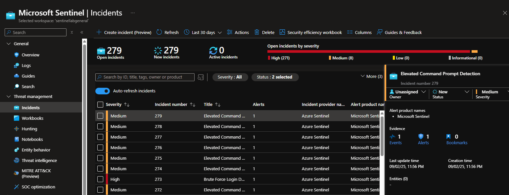

# Executive summary
This case study captures how I enabled Microsoft Sentinel monitoring for the Windows 10 host `SentinelVM1` by deploying the Azure Monitor Agent (AMA) and configuring Data Collection Rules (DCRs) for Windows Security and Sysmon telemetry. I ran structured KQL checks to make sure the Heartbeat, SecurityEvent, and Event tables received the right data. I also reviewed Sentinel analytics rules for elevated command prompts, encoded PowerShell, and brute-force logons, then ran controlled simulations to see whether the alerts would fire. Investigating the incidents confirmed that the detection pipeline escalated the activity I generated. The results show that the lab is ready for further defensive experiments tied to MITRE ATT&CK techniques.

# Background & scope
- **Scenario:** Build a focused Sentinel lab to validate AMA onboarding, DCR targeting for Sysmon, and alerting logic using controlled simulations on a single Windows 10 endpoint.
- **Constraints:** One Azure subscription with limited resources, single Sentinel workspace, Azure-native tooling only, no third-party ingestion.
- **In scope:** AMA deployment checks, DCR configuration review, telemetry validation via KQL, analytics rule inspection, alert verification, documentation of evidence.
- **Out of scope:** Production hardening, automation playbooks, multi-workspace federation, third-party connectors, incident response beyond confirmation of alert creation.

# Environment & setup
| Component | Details |
| --- | --- |
| Host | Windows 10 VM `SentinelVM1` |
| Sentinel workspace | Single Microsoft Sentinel workspace (name redacted) |
| Agent | Azure Monitor Agent v1.37.0.0 |
| Data collection | Windows Security Events connector; Sysmon custom XPath (`Microsoft-Windows-Sysmon/Operational!*`) |
| Analytics content | Suspicious Elevated Command Prompt Activity; Encoded PowerShell Execution; Brute Force Login Detection |

# Tools used
- **Microsoft Sentinel Logs (KQL):** I queried the Heartbeat, SecurityEvent, and Event tables to prove telemetry was flowing.
- **Azure Portal Data Collection Rules:** I double-checked the `SysmonWindows` rule to confirm the Sysmon operational channel was captured through custom XPath.
- **Microsoft Sentinel Analytics:** I reviewed the scheduled analytic rules linked to the behaviours I simulated.
- **Sentinel Incidents blade:** I inspected each incident generated after the tests to confirm alert delivery.

# Analysis steps (reproducible)
1. **Heartbeat validation**
   - Portal navigation: **Microsoft Sentinel > <workspace> > Logs**.
   - Run:
     ```kql
     Heartbeat
     | where Category == "Azure Monitor Agent"
     | summarize LatestVersion = any(Version) by Computer
     ```
   - Expected outcome: `SentinelVM1` listed with Version `1.37.0.0`. If missing, return to **Virtual machines > SentinelVM1 > Extensions + applications** and confirm the Azure Monitor Agent extension shows `Provisioning state: Succeeded`.
2. **Windows Security Event ingestion check**
   - Portal navigation: **Microsoft Sentinel > <workspace> > Content management > Data connectors > Windows Security Events via AMA > Open connector page**.
   - Verify the connector status is **Connected** and the `Windows-AMA-DCR` assignment includes **Process creation events**.
   - Run:
     ```kql
     SecurityEvent
     | where EventID == 4688
     | summarize Events = count() by Computer, Account, Process
     ```
   - Expected outcome: multiple EventID 4688 records from `SentinelVM1`. If empty, launch Notepad or PowerShell on the VM to generate new process creation logs and rerun the query.
3. **Sysmon telemetry confirmation**
   - Portal navigation: **Azure Monitor > Data Collection Rules > SysmonWindows > Edit**.
   - Confirm that **Windows event logs** includes the XPath `Microsoft-Windows-Sysmon/Operational!*` targeting the **Event** table and that `SentinelVM1` is listed under **Resources**.
   - Run:
     ```kql
     Event
     | where EventLog == "Microsoft-Windows-Sysmon/Operational"
     | summarize Events = count() by EventID
     ```
   - Expected outcome: Event IDs 1 (process creation) and 10 (process access) appear with non-zero counts. If missing, rerun the Sysmon installer with administrative rights and reapply the DCR.
4. **Analytics rule verification**
   - Portal navigation: **Microsoft Sentinel > <workspace> > Configuration > Analytics**.
   - Open each rule: *Suspicious Elevated Command Prompt Activity*, *Encoded PowerShell Execution*, and *Brute Force Login Detection*.
   - Confirm the **Status** is **Enabled**, **Query scheduling** is set to a 5-minute frequency with a 5-minute lookup, and the **Tactics** align with the MITRE mappings documented in this study.
5. **Simulate adversary behaviours on SentinelVM1**
   - Elevated command prompt (run in Windows PowerShell):
     ```powershell
     Start-Process cmd.exe -Verb RunAs
     ```
   - Encoded PowerShell execution:
     ```powershell
     powershell.exe -EncodedCommand SQBFAFgALgBlAHgAZQAgACIAQwBtAGQAIgA=
     ```
     (Base64 decodes to `IEX "Cmd"`, giving a harmless invocation while exercising the analytic logic.)
   - Brute-force login pattern:
     ```cmd
     runas /user:.\labuser cmd.exe
     ```
     Enter a wrong password three times, then supply the correct password on the fourth attempt.
   - Note the local timestamps for correlation with Sentinel incidents.
6. **Incident confirmation**
   - Portal navigation: **Microsoft Sentinel > <workspace> > Incidents**.
   - Filter by **Status: Active** and locate incidents created by the three analytics rules. Open each incident, review the **Alerts** tab, and capture the incident ID, creation time, and linked entities for documentation. Close the incidents after evidence is collected to keep the workspace tidy.

# Findings & interpretation
- **AMA heartbeat confirmed:** Heartbeat entries display Category `Azure Monitor Agent` and Version `1.37.0.0`, showing that `SentinelVM1` reports successfully to Sentinel. 
- **Security events ingested:** Query results surface EventID 4688 process creation logs, proving that Windows Security telemetry reaches the workspace. 
- **Sysmon DCR scoped correctly:** The `SysmonWindows` DCR uses a custom XPath targeting `Microsoft-Windows-Sysmon/Operational!*`, so Sysmon events are routed to Sentinel. 
- **Analytics rules active:** The three scheduled rules are enabled with suitable severities and MITRE mappings, so they are ready to detect the simulated behaviours. 
- **Alert triggered as expected:** The elevated command prompt analytic produced Incident 279 with Medium severity, confirming end-to-end detection and incident creation. 

# MITRE ATT&CK mapping
| Technique ID | Technique name | Evidence |
| --- | --- | --- |
| T1059 | Command and Scripting Interpreter | Suspicious Elevated Command Prompt Activity rule triggered by simulated elevated `cmd.exe` execution (`images/alert_trigger.png`). |
| T1059.001 | PowerShell | Encoded PowerShell Execution analytic rule enabled to monitor PowerShell abuse (`images/detection_rules.png`). |
| T1110 | Brute Force | Brute Force Login Detection analytic rule active, ready to spot password guessing attempts (`images/detection_rules.png`). |

# Limitations & caveats
- Single-host lab limits visibility into lateral movement, persistence, or multi-stage adversary actions.
- Simulations provide controlled validation; real-world threat activity may show different signatures and false positives.
- Analytics thresholds were not tuned for production-scale telemetry and may need adjustment before deployment.
- Automated response workflows were not evaluated; incident handling stayed manual within this lab.

# Recommendations
- Onboard additional endpoints and Azure AD sign-in logs to broaden coverage and enrich correlation opportunities.
- Develop automation rules or Logic Apps to triage recurring alerts and reduce manual workload.
- Tune detection rules based on baseline telemetry and add suppression logic to minimise noise.
- Schedule routine health checks for AMA agents and DCR assignments to keep data flowing.

# Artefacts & screenshots
- `images/heartbeat.png`
- `images/securityevent_ingestion.png`
- `images/sysmondcr.png`
- `images/detection_rules.png`
- `images/alert_trigger.png`
- `CASE_STUDY.md`

# Reproducibility and cost/safety controls
- Deallocate or stop `SentinelVM1` when not required to minimise compute consumption.
- Remove or disable the `SysmonWindows` DCR and AMA extension once testing concludes to prevent unnecessary charges.
- Conduct simulations within isolated lab credentials and networks to avoid unintended impact on production resources.

# Appendix — trimmed outputs
```
Heartbeat | summarize by Computer, Version => SentinelVM1 / 1.37.0.0
SecurityEvent (EventID 4688) => Multiple cmd.exe and powershell.exe process creations
Incident 279 => Elevated Command Prompt Detection, Medium severity, 1 alert linked
```
