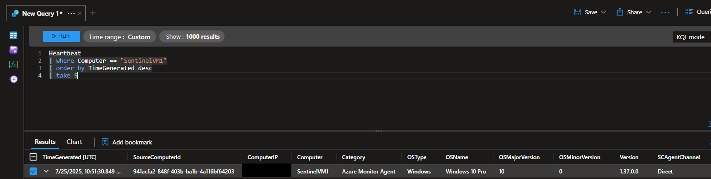
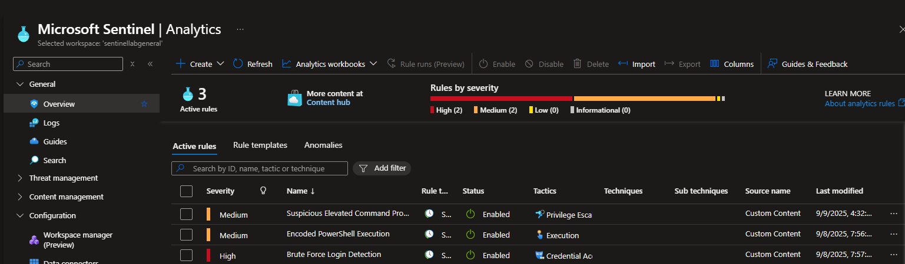

# Executive summary
This case study documents the enablement of Microsoft Sentinel monitoring for the Windows 10 host `SentinelVM1` by deploying the Azure Monitor Agent (AMA) and configuring Data Collection Rules (DCRs) for Windows Security and Sysmon telemetry. Structured KQL validation confirmed that Heartbeat, SecurityEvent, and Event tables received the intended data streams. I inspected Sentinel analytics rules covering elevated command prompts, encoded PowerShell, and brute-force logons, then executed controlled simulations to test alert coverage. Incident review demonstrated that the detection pipeline escalated the expected activity. These results verify that the lab environment is ready for continued defensive experimentation aligned with MITRE ATT&CK techniques.

# Background & scope
- **Scenario:** Build a focused Sentinel lab to validate AMA onboarding, DCR targeting for Sysmon, and alerting logic using controlled simulations on a single Windows 10 endpoint.
- **Constraints:** One Azure subscription with limited resources, single Sentinel workspace, Azure-native tooling only, no third-party ingestion.
- **In scope:** AMA deployment checks, DCR configuration review, telemetry validation via KQL, analytics rule inspection, alert verification, documentation of evidence.
- **Out of scope:** Production hardening, automation playbooks, multi-workspace federation, third-party connectors, incident response beyond confirmation of alert creation.

# Environment & setup
| Component | Details |
| --- | --- |
| Host | Windows 10 VM `SentinelVM1` |
| Sentinel workspace | Single Microsoft Sentinel workspace (name redacted) |
| Agent | Azure Monitor Agent v1.37.0.0 |
| Data collection | Windows Security Events connector; Sysmon custom XPath (`Microsoft-Windows-Sysmon/Operational!*`) |
| Analytics content | Suspicious Elevated Command Prompt Activity; Encoded PowerShell Execution; Brute Force Login Detection |

# Tools used
- **Microsoft Sentinel Logs (KQL):** Executed Heartbeat, SecurityEvent, and Event table queries to confirm telemetry ingestion.
- **Azure Portal Data Collection Rules:** Reviewed the `SysmonWindows` rule to ensure the Sysmon operational channel was targeted through custom XPath.
- **Microsoft Sentinel Analytics:** Validated the status and configuration of scheduled analytic rules associated with the simulated behaviors.
- **Sentinel Incidents blade:** Examined generated incidents to verify alert delivery after the test executions.

# Analysis steps (reproducible)
1. Verify AMA heartbeat:
   ```kql
   Heartbeat
   | where Category == "Azure Monitor Agent"
   | summarize by Computer, Version
   ```
2. Confirm Windows Security Event ingestion:
   ```kql
   SecurityEvent
   | where EventID == 4688
   | summarize Count = count() by Computer, Account, Process
   ```
3. Confirm Sysmon telemetry via DCR:
   ```kql
   Event
   | where EventLog == "Microsoft-Windows-Sysmon/Operational"
   | summarize Count = count() by EventID
   ```
4. Review analytics rule status within the Sentinel portal for the three scheduled rules (portal navigation: Microsoft Sentinel > Configuration > Analytics).
5. Execute simulated elevated `cmd.exe`, encoded PowerShell, and credential brute-force sequences on `SentinelVM1` to drive detections.
6. Inspect Sentinel Incidents for alerts generated by the simulations, confirming rule execution and incident creation.

# Findings & interpretation
- **AMA heartbeat confirmed:** Heartbeat entries display Category `Azure Monitor Agent` and Version `1.37.0.0`, confirming that `SentinelVM1` reports successfully to Sentinel. 
- **Security events ingested:** Query results surface EventID 4688 process creation logs, demonstrating that Windows Security telemetry is flowing into the workspace. 
- **Sysmon DCR scoped correctly:** The `SysmonWindows` DCR uses a custom XPath targeting `Microsoft-Windows-Sysmon/Operational!*`, ensuring Sysmon events are routed to Sentinel. 
- **Analytics rules active:** The three scheduled rules are enabled with appropriate severities and MITRE mappings, indicating readiness to detect the simulated behaviors. 
- **Alert triggered as expected:** The elevated command prompt analytic produced Incident 279 with Medium severity, verifying end-to-end detection and incident creation. 

# MITRE ATT&CK mapping
| Technique ID | Technique name | Evidence |
| --- | --- | --- |
| T1059 | Command and Scripting Interpreter | Suspicious Elevated Command Prompt Activity rule triggered by simulated elevated `cmd.exe` execution (`images/alert_trigger.png`). |
| T1059.001 | PowerShell | Encoded PowerShell Execution analytic rule enabled to monitor PowerShell abuse (`images/detection_rules.png`). |
| T1110 | Brute Force | Brute Force Login Detection analytic rule active, prepared to identify password guessing attempts (`images/detection_rules.png`). |

# Limitations & caveats
- Single-host lab limits visibility into lateral movement, persistence, or multi-stage adversary actions.
- Simulations provide controlled validation; real-world threat activity may present different signatures and false positives.
- Analytics thresholds were not tuned for production-scale telemetry and may require adjustment before deployment.
- Automated response workflows were not evaluated; incident handling remains manual within this lab.

# Recommendations
- Onboard additional endpoints and Azure AD sign-in logs to broaden coverage and enrich correlation opportunities.
- Develop automation rules or Logic Apps to triage recurring alerts and reduce manual workload.
- Tune detection rules based on baseline telemetry and incorporate suppression logic to minimize noise.
- Schedule routine health checks for AMA agents and DCR assignments to ensure continuous data flow.

# Artefacts & screenshots
- `images/heartbeat.png`
- `images/securityevent_ingestion.png`
- `images/sysmondcr.png`
- `images/detection_rules.png`
- `images/alert_trigger.png`
- `CASE_STUDY.md`

# Reproducibility and cost/safety controls
- Deallocate or stop `SentinelVM1` when not required to minimize compute consumption.
- Remove or disable the `SysmonWindows` DCR and AMA extension once testing concludes to prevent unnecessary charges.
- Conduct simulations within isolated lab credentials and networks to avoid unintended impact on production resources.

# Appendix — trimmed outputs
```
Heartbeat | summarize by Computer, Version => SentinelVM1 / 1.37.0.0
SecurityEvent (EventID 4688) => Multiple cmd.exe and powershell.exe process creations
Incident 279 => Elevated Command Prompt Detection, Medium severity, 1 alert linked
```
