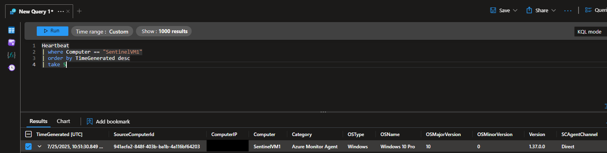
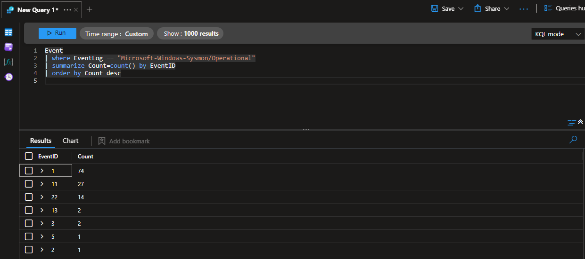
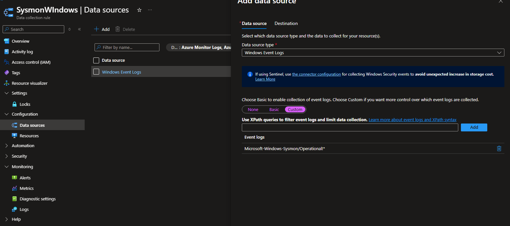
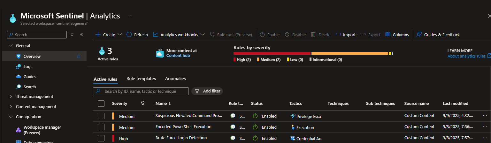

# Microsoft Sentinel Lab: Windows Security & Sysmon Logs

## Project Overview
For this project I used Microsoft Sentinel with the Azure Monitor Agent (AMA) to collect logs from a Windows 10 VM.  
The goal was to ingest both **Windows Security Events** and **Sysmon telemetry**, then create detection rules to spot suspicious activity.  
This helped me practice SIEM setup, log collection, KQL queries, and troubleshooting.

---

## Setup

1. **Agent**  
   - Installed AMA via VM extensions.  
   - Verified with the `Heartbeat` table (`Category = Azure Monitor Agent`, version `1.37.0.0`).
  


2. **Windows Security Logs**  
   - Enabled the Windows Security Events via AMA connector.  
   - Confirmed Security events (e.g., EventID 4688 – new process created) appeared in the `SecurityEvent` table.



3. **Sysmon Logs**  
   - Installed Sysmon with default config.  
   - Added a Data Collection Rule (DCR) for:  
     ```
     Microsoft-Windows-Sysmon/Operational!*
     ```
   - Logs appeared in the `Event` table.
   


---

## Troubleshooting

At first, I thought AMA was not working because logs still showed:

```
SourceSystem = OpsManager
```

Normally this means the older MMA agent. After checking further, I learned AMA sometimes still uses this label for compatibility.  
By looking at Heartbeat logs I confirmed AMA was active (`Category = Azure Monitor Agent`, `Version = 1.37`).  

**Lesson:** don’t rely only on `SourceSystem`. Check multiple fields (Category, Version, DCR assignment).

---

## Detection Rules

Each detection was implemented as a **Scheduled Analytics Rule** in Sentinel.  
- **Frequency:** Every 5 minutes  
- **Lookback period:** Last 5 minutes  
- **Effect:** Queries only need to describe the event logic. Sentinel handles the rolling time window automatically.  



---

### 1. Suspicious Elevated Command Prompt Activity
**Purpose:** Detects `cmd.exe` run with elevation.  

```kql
SecurityEvent
| where EventID == 4688
| extend Proc = tolower(NewProcessName), Parent = tolower(ParentProcessName)
| where Proc endswith "\\cmd.exe"
| where TokenElevationType == "%%1937"   
| project TimeGenerated, Computer, Account, AccountDomain, NewProcessName, ParentProcessName, CommandLine, TokenElevationType
```

- Severity: Medium  
- MITRE ATT&CK: T1059 (Command and Scripting Interpreter)  
- **Testing:** I launched `cmd.exe` as Administrator from Explorer. Sentinel raised an alert based on this rule.

---

### 2. Encoded PowerShell Execution
**Purpose:** Detects use of `-EncodedCommand` or `-enc` in PowerShell.  

```kql
SecurityEvent
| where EventID == 4688
| where tolower(NewProcessName) endswith "powershell.exe"
| where CommandLine contains "-encodedcommand" or CommandLine contains " -enc "
| project TimeGenerated, Computer, Account, CommandLine, ParentProcessName
```

- Severity: Medium  
- MITRE ATT&CK: T1059.001 (PowerShell)  
- **Testing:** I ran a PowerShell command with the `-enc` flag. The rule fired and generated an alert.

---

### 3. Brute Force Login Detection
**Purpose:** Detects 5+ failed logins in 5 minutes, with optional success correlation.  

```kql
let Failed = SecurityEvent
| where EventID == 4625
| summarize FailedLogins = count() by Account, IpAddress, bin(TimeGenerated, 5m)
| where FailedLogins > 5;
let Success = SecurityEvent
| where EventID == 4624
| project Account, IpAddress, TimeGenerated;
Failed
| join kind=leftouter (Success) on Account, IpAddress
| project Account, IpAddress, FailedLogins, FirstFailed=bin(TimeGenerated, 5m), SuccessTime=TimeGenerated
```

- Severity: High  
- MITRE ATT&CK: T1110 (Brute Force)  
- **Testing:** I attempted multiple failed logins on the VM using the wrong password, then succeeded. The rule correctly detected the brute force and flagged it.

---

## Validation Queries

- Count logs by table:
```kql
search *
| summarize Events=count() by $table
```

- Sysmon event counts:
```kql
Event
| where EventLog == "Microsoft-Windows-Sysmon/Operational"
| summarize Count=count() by EventID
```

- Security event counts:
```kql
SecurityEvent
| summarize Count=count() by EventID
```

---

## Results
- Security logs: ~1,200 events (logons, process creation, failed logons).  
- Sysmon logs: ~100 events (process creation, network connections, image loads).  
- Custom rules triggered correctly when tested.  

---

## Lessons Learned
- AMA requires DCRs — no DCR = no data.  
- Sysmon must be explicitly added.  
- `SourceSystem` is misleading for AMA vs MMA.  
- Best way to test is to generate fresh events (open notepad, run ping).  

---

## Next Steps
- Expand with detections for lateral movement and persistence.  
- Create a Sentinel workbook for visualization.  
- Add more data sources (Azure AD, Office 365).  

---

## Author
Ayrton Cook  
BSc Computer Science with Year in Industry (Cybersecurity focus)  
University of East Anglia  
